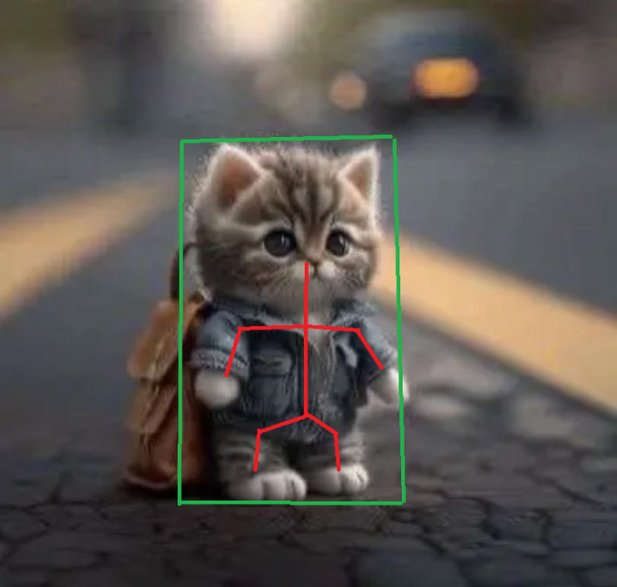
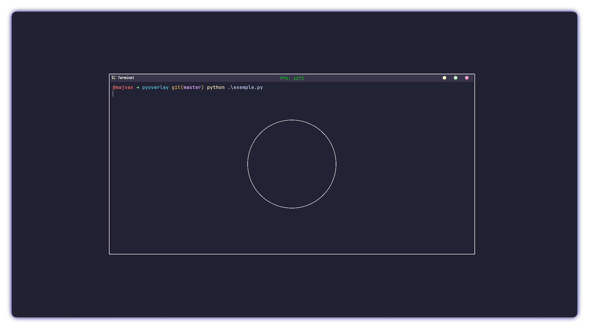

<div align="center">
    
    <H3>PyOverlay</H3>
    <p> 
        <a href="https://github.com/majvax/pyoverlay/stargazers"></a>
        <a href="https://github.com/majvax/pyoverlay/issues"></a>
        <a href="https://github.com/majvax/pyoverlay/contributors"></a>
    </p>    
</div>

> [!CAUTION]
> This project is not mature enough, I do not plan to add update soon so you may need to adapt the overlay to your need

<details>
    <summary>Table of Contents</summary>
    <ol>
        <li><a href="#description">Description</a></li>
        <li><a href="#preview">Preview</a></li>
        <li>
            <a href="#getting-started">Getting Started</a>
            <ul>
                <li><a href="#installation">Installation</a></li>
                <li><a href="#usage">Usage</a></li>
            </ul>
        </li>
    </ol>
</details>

<hr>

<div align="center" id="preview">
    <H3>Description 📸</H3>
    <h6>Easily create and manage overlay for any game/appliction using pyopengl and glfw<H6>
</div>

<hr>


<div align="center" id="preview">
    <H3>Preview 📸</H3>
    
</div>
<hr>
<div align="center" id="installation">
    <H3>Installation 💾</H3>
    <H6>Install from pip</H6>

```
pip install pyoverlay
```

<H6>Install from source</H6>
*note that the wheel file may not have this name*

```
git clone https://github.com/majvax/pyoverlay.git
cd pyoverlay
python -m build
cd dist
pip install pyoverlay.whl
```

</div>

<hr>

<div align="center" id="usage">
    <H3>Usage 📕</H3>
    <div align="left">

<H6>Exemple using a fonction</H6>

```python
from pyoverlay import Overlay, Point, Rect, RGBA, Color
import win32con

# create the function that will be ran every frames
def on_tick(overlay: Overlay) -> None:
    # https://learn.microsoft.com/fr-fr/windows/win32/inputdev/virtual-key-codes
    if overlay.get_input(win32con.VK_ESCAPE):
        # stops our overlay
        overlay.stop()

    # only draw if the target is the foreground window
    if overlay.target.is_valid:
        overlay.draw_test(overlay.target.rect)


if __name == "__main__":
    # create our overlay object
    overlay = Overlay("Calculator")
    overlay.on_tick = on_tick

    # create the overlay
    overlay.create()

    # infinite loop 
    overlay.run()
```

<H6>Exemple using a class</H6>

```python
from pyoverlay import Overlay, Point, Rect, RGBA, Color
import win32con


class OnTick:
    def __init__(self):
        self.fov_radius = 50
    
    # create the method that will be ran every frames
    def __call__(self, overlay: Overlay):
        # https://learn.microsoft.com/fr-fr/windows/win32/inputdev/virtual-key-codes
        if overlay.get_input(win32con.VK_ESCAPE):
            # stops our overlay
            overlay.stop()

        # increase the fov on PAGE_UP
        if overlay.get_input(win32con.VK_PRIOR):
            self.fov_radius += 1

        # decrease the fov on PAGE_DOWN
        if overlay.get_input(win32con.VK_NEXT):
            self.fov_radius -= 1

        # only draw if the target is the foreground window
        if overlay.target.is_valid:
            # draw an empty circle
            overlay.draw_empty_circle(overlay.target.rect.center, self.fov_radius, Color.WHITE)


if __name == "__main__":
    # create our overlay object
    overlay = Overlay("Calculator")
    overlay.on_tick = on_tick

    # create the overlay
    overlay.create()

    # infinite loop 
    overlay.run()
```

</div>
</div>
